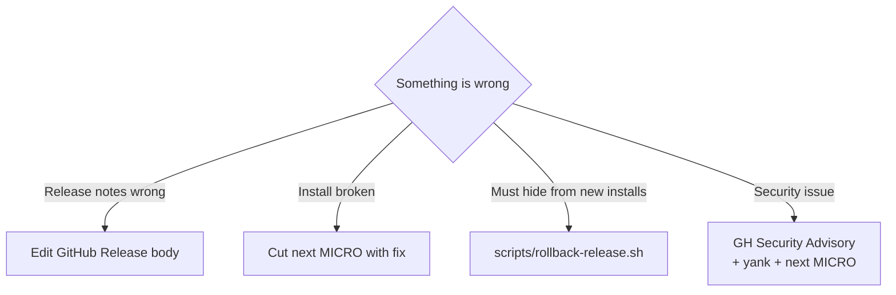

# Release runbook

This is the authoritative procedure for cutting a `gotime` release. It sits on
top of the version *semantics* described in [`versioning.md`](versioning.md)
and describes the *process*.

## Goals

1. **Tag drives everything.** The tag is the source of truth for the version;
   the build can be reproduced from the tag alone.
2. **No long-lived secrets.** PyPI publishes via OIDC Trusted Publishing; no
   `PYPI_TOKEN` ever lives in Actions secrets.
3. **Humans approve the moment money / reputation gets spent.** The only
   manual gate is approving the `pypi` GitHub Environment deployment.
4. **CHANGELOG == Release body == PyPI description.** One source of truth.
5. **Rollbacks are cheap and documented.** We never rewrite or delete tags.

## One-time maintainer setup

Each maintainer (once):

1. Generate a GPG key and tell GitHub about it:

   ```bash
   gpg --full-generate-key  # ed25519, no expiration is fine
   gh gpg-key add ~/.gnupg/pubring.kbx
   git config --global user.signingkey <KEY_ID>
   git config --global tag.gpgSign true
   ```

2. The repo owner configures:

   - **PyPI Trusted Publisher** for the `gotime` project pointing at this
     repo and the `release.yml` workflow. (PyPI → Manage → Publishing →
     Add a new pending publisher.)
   - **GitHub Environment `pypi`** with at least one *required reviewer*
     and the rule *"only protected branches and tags can deploy"*.

That's it. No API tokens, no per-maintainer PyPI credentials.

## Normal release

```mermaid
flowchart LR
    Unreleased["CHANGELOG<br/>[Unreleased]"] --> Prep["scripts/prepare-release.sh"]
    Prep --> PR["release/bump-X.Y.Z PR"]
    PR --> Main["Merge to main"]
    Main --> Tag["git tag --annotate --sign<br/>git push origin X.Y.Z"]
    Tag --> Verify["release.yml: verify-tag"]
    Verify --> Build["build + attest"]
    Build --> Gate["Environment: pypi<br/>(human approval)"]
    Gate --> PyPI["publish-pypi"]
    PyPI --> Release["GitHub Release<br/>(body from CHANGELOG)"]
    Release --> Smoke["smoke-test<br/>pip install & --version"]
```



Step by step:

1. Pick the next version following [`versioning.md`](versioning.md). Example:
   you're on `2026.1.0` and adding a provider, so the next tag is `2026.2.0`.

2. From a clean `main`:

   ```bash
   git checkout main && git pull --ff-only origin main
   scripts/prepare-release.sh 2026.2.0
   ```

   That script flips `## [Unreleased]` in `CHANGELOG.md` to
   `## [2026.2.0] - YYYY-MM-DD`, updates the link references at the bottom,
   opens a PR, and stops. Review the diff, get CI green, merge.

3. After the PR merges, cut the tag locally (signing required):

   ```bash
   git checkout main && git pull --ff-only origin main
   git tag --annotate --sign 2026.2.0 --message "Release 2026.2.0"
   git push origin 2026.2.0
   ```

4. Watch `release.yml`. It will:
   - Refuse the tag if it's lightweight or not reachable from `main`.
   - Refuse the tag if `CHANGELOG.md` has no matching `## [2026.2.0]` section.
   - Build the wheel and sdist (`hatch-vcs` derives `2026.2.0` from the tag).
   - Attest SLSA build provenance for the artifacts.
   - Pause on the **`pypi` environment approval gate** — that's you.
   - Publish to PyPI via OIDC, create the GitHub Release with the body
     pulled from `CHANGELOG.md`, and install the package in a clean image
     to smoke-test `gotime --version`.

5. Read the Docs rebuilds automatically from the new tag (configured in
   `.readthedocs.yaml`).

## Backport / hotfix flow

For a fix on an older line of releases:

1. Branch from the old tag: `git checkout --branch release/2026.1 2026.1.0`.
2. Cherry-pick or author the fix. Update `CHANGELOG.md` under a new
   `## [2026.1.1] - YYYY-MM-DD` header.
3. Push the branch, open a PR into *itself* for review. After merge:

   ```bash
   git tag --annotate --sign 2026.1.1 --message "Release 2026.1.1"
   git push origin 2026.1.1
   ```

4. The workflow's `verify-tag` check is satisfied because branches named
   `release/*` are pre-approved alongside `main`. (If not, adjust the branch
   ancestry check in `.github/workflows/release.yml`.)

## Pre-release flow

Same as a normal release but with a PEP 440 suffix on the version:

```bash
scripts/prepare-release.sh 2026.2.0rc1
# merge the PR, then:
git tag --annotate --sign 2026.2.0rc1 --message "Release 2026.2.0rc1"
git push origin 2026.2.0rc1
```

`pip install gotime` won't pick it up without `--pre`, and the GitHub
Release is flagged as a pre-release automatically.

## Failure playbook



### Rollback (`scripts/rollback-release.sh X.Y.Z`)

1. Marks the GitHub Release as prerelease (soft-hide; does not delete).
2. Prints the exact web-UI steps to **yank the wheel and sdist on PyPI**.
   OIDC Trusted Publishing deliberately does not grant yank permissions, so
   this step must be performed from a browser session authenticated as a
   maintainer. No long-lived API token is created just for rollback.
3. Prints the suggested next version to cut alongside the revert / fix.

Yanked releases remain on PyPI so pinned consumers still resolve them, but
`pip install gotime` will skip them without an explicit version pin.

## Who can release?

- Anyone with *write* access to the repo can run `prepare-release.sh` and
  push a tag — the tag is easy to revert if wrong (nothing is published
  until the build succeeds and the PyPI environment reviewer approves).
- Only reviewers of the `pypi` GitHub Environment can actually release to
  PyPI.

## Cross-references

- [`versioning.md`](versioning.md) — what a version means.
- [`roadmap.md`](roadmap.md) — what's coming in future `MINOR` releases.
- [`CHANGELOG.md`](https://github.com/mgeiger/gotime/blob/main/CHANGELOG.md)
  — what shipped in every past release.
- [`CONTRIBUTING.md`](https://github.com/mgeiger/gotime/blob/main/CONTRIBUTING.md)
  — how to get a PR into a release.
