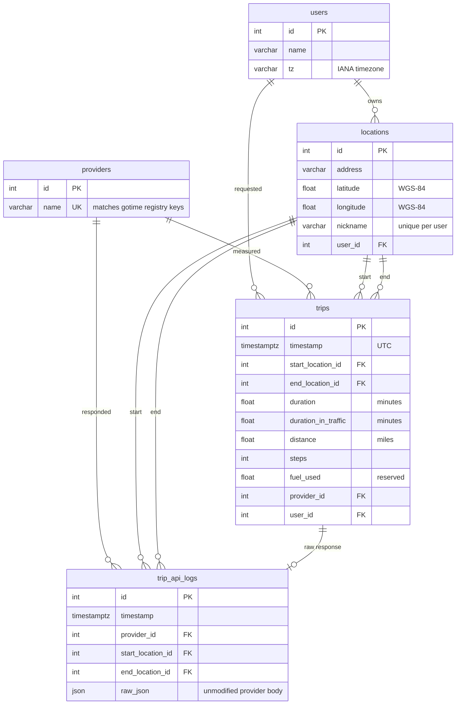

# Database schema

The canonical schema lives in `src/gotime/db/models.py`. All timestamps are
stored in UTC with tzinfo.

## Entity-relationship diagram

## Tables

### `users`
| Column | Type | Null | Notes |
| --- | --- | --- | --- |
| `id` | `INTEGER PK` | no | Auto-increment. |
| `name` | `VARCHAR` | yes | Display name. |
| `tz` | `VARCHAR` | yes | IANA tz, e.g. `America/New_York`. |

### `providers`
| Column | Type | Null | Notes |
| --- | --- | --- | --- |
| `id` | `INTEGER PK` | no |   |
| `name` | `VARCHAR UNIQUE` | no | Matches `gotime.providers.registry` keys. |

### `locations`
| Column | Type | Null | Notes |
| --- | --- | --- | --- |
| `id` | `INTEGER PK` | no |   |
| `address` | `VARCHAR` | no | Full postal address. |
| `latitude` | `FLOAT` | yes | WGS-84. |
| `longitude` | `FLOAT` | yes | WGS-84. |
| `nickname` | `VARCHAR` | yes | Display label. Unique per-user. |
| `user_id` | `FK users.id` | yes |   |

### `trips`
| Column | Type | Units | Notes |
| --- | --- | --- | --- |
| `id` | `INTEGER PK` | — |   |
| `timestamp` | `TIMESTAMPTZ` | UTC | Time of the API call. `DEFAULT CURRENT_TIMESTAMP` at the SQL level plus a Python `_utcnow()` default from the ORM. |
| `start_location_id` | `FK locations.id` | — |   |
| `end_location_id` | `FK locations.id` | — |   |
| `duration` | `FLOAT` | minutes | Free-flow duration, when available. |
| `duration_in_traffic` | `FLOAT` | minutes | Real-time traffic estimate. |
| `distance` | `FLOAT` | miles | Conversion from meters at persist time. |
| `steps` | `INTEGER` | count | Maneuver steps (when provider returns them). |
| `fuel_used` | `FLOAT` | gallons | Reserved; unused by v1. |
| `provider_id` | `FK providers.id` | — |   |
| `user_id` | `FK users.id` | — |   |

Indexes and constraints:

| Name | Kind | Columns | Purpose |
| --- | --- | --- | --- |
| `uq_trip_dedup` | `UNIQUE` | `provider_id, timestamp, start_location_id, end_location_id` | Lets the legacy-data merge importers in `scripts/merge/` run idempotently (`ON CONFLICT DO NOTHING`). |
| `ix_trip_timestamp` | `INDEX` | `timestamp` | Covers dashboard time-window and date-range queries. |
| `ix_trip_provider` | `INDEX` | `provider_id` | Covers per-provider aggregates in the stats API. |

### `trip_api_logs`
| Column | Type | Notes |
| --- | --- | --- |
| `id` | `INTEGER PK` |   |
| `timestamp` | `TIMESTAMPTZ` | Matches parent trip. Same `DEFAULT CURRENT_TIMESTAMP` + Python default as `trips`. |
| `provider_id` | `FK providers.id` |   |
| `start_location_id` | `FK locations.id` |   |
| `end_location_id` | `FK locations.id` |   |
| `raw_json` | `JSON` / `JSONB` | Unmodified provider response. Only populated when `GOTIME_STORE_RAW_RESPONSES=true`; off by default for Terms-of-Service reasons (see [`compliance.md`](compliance.md)). |

### Dialect notes

- `raw_json` is declared as the generic SQLAlchemy `JSON` type. On
  PostgreSQL this is rendered as `JSONB` (matching
  `scripts/merge/seed_canonical.sql`); on SQLite it degrades to `TEXT`
  with JSON serialization, which keeps the local dev loop simple.
- `timestamp` columns carry **both** a Python-side default (`_utcnow`)
  and a SQL-side `server_default=CURRENT_TIMESTAMP`. The Python default
  means SQLite inserts without a server-default still work; the server
  default keeps the Alembic-managed schema in lock-step with the merge
  importers' raw SQL, which depend on the DB-side behaviour.

The alignment between `src/gotime/db/models.py`,
`alembic/versions/0002_trip_indexes_and_defaults.py`, and
`scripts/merge/seed_canonical.sql` is enforced by
`tests/test_schema_drift.py`, which parses the canonical SQL when
present and fails if any of the three shifts out from under the others.

## Provider capability matrix

| Provider | Duration | Duration-in-traffic | Distance | Steps |
| --- | :---: | :---: | :---: | :---: |
| Google | ✅ | ✅ | ✅ | ✅ |
| Bing | ✅ | ✅ | ✅ | — |
| TomTom | ✅ (derived) | ✅ | ✅ | — |
| HERE | ✅ | ✅ | ✅ | — |
| MapQuest | ✅ | ✅ | ✅ | — |
| Mapbox (driving-traffic) | ✅ | ✅ (same) | ✅ | — |
| Azure | ✅ (derived) | ✅ | ✅ | — |

Fields marked `—` are left `NULL`; downstream analytics must tolerate that.
